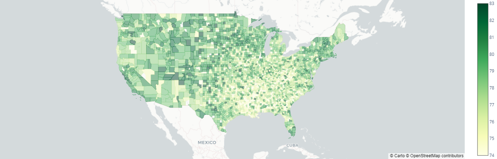
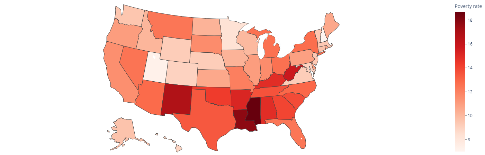
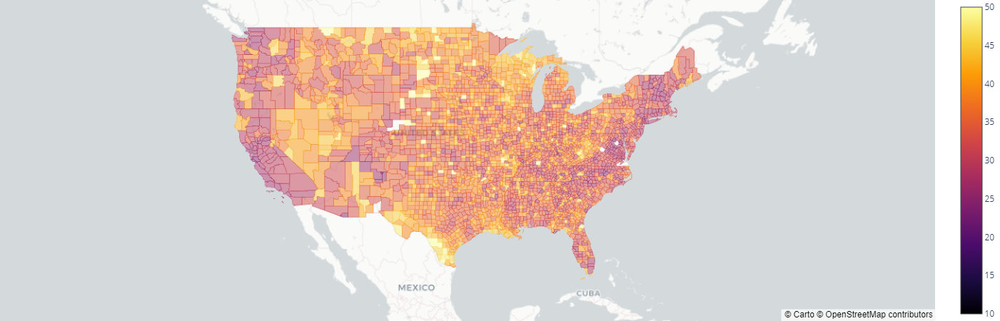
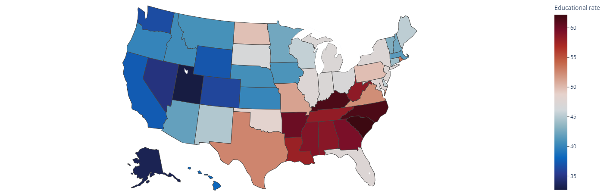
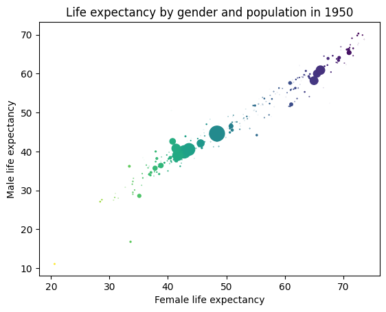
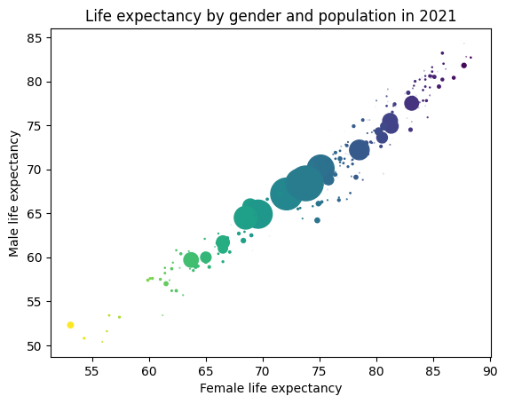
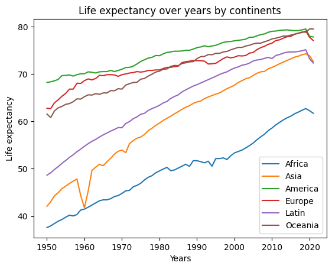
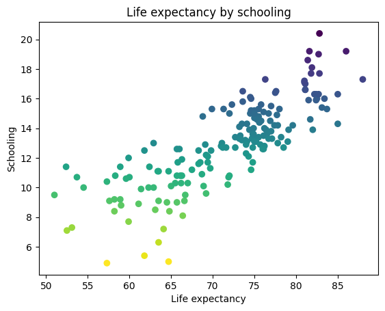
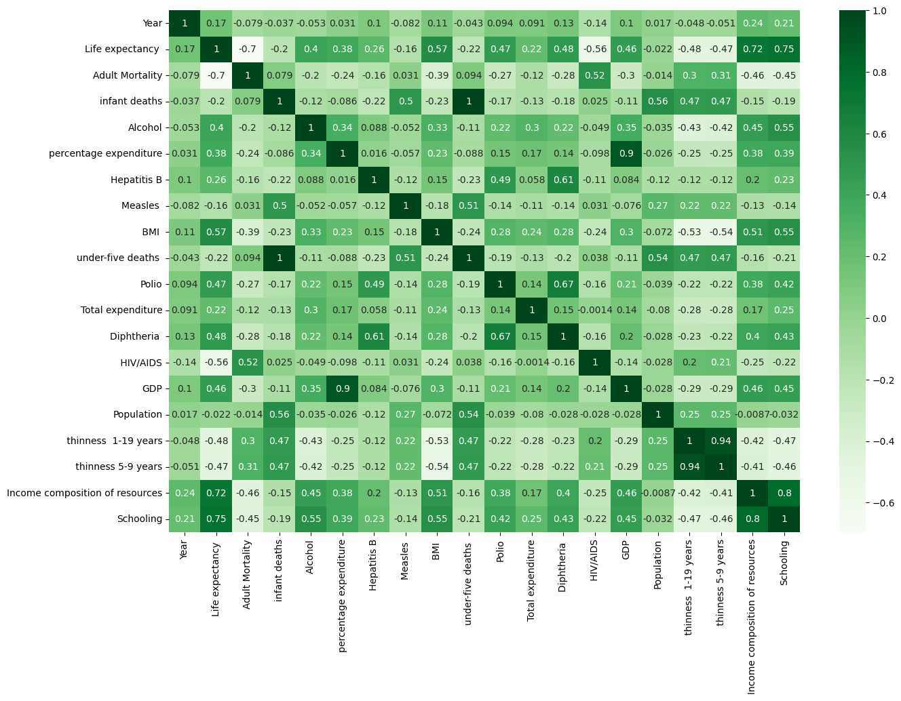

# Life-Expectancy

The project consist to make a study using data available online and finding factors responsible of Life Expectancy.  
Master 1 project made for the Data Science with Python cursus at Efrei Paris.  
Made with Sivananthan Sarankan and Sebastiao-Esteves Kevin.  
Here some results obtained by the study of a dozen of datasets about Life Expectancy :  

## Study about USA

Life expectancy by states in the US :

Life expectancy by counties in the US :

Amount of smokers by US states : 

Amount of civilians living under poverty rate by US states : 

Amount of alohol consummer by US states : 

Percent of adults with less than a high school diploma 1970 : 

## Global study

Life expectancy by gender and population in 1950 :

Life expectancy by gender and population in 2021 :

Life expectancy over years by continents :

Life expectancy in Europe :

Life expectancy by schooling :

Global Heatmap on all variables :

# Conclusions

In the case of the US, we can see a great correlation between life expectancy, poverty, education and somker rate.   
Always in the US we can see high disparities between states and even between counties inside the same state.  
On the global scale, we can assume that life expectancy has increased over year due to technological advances.  
The gape between the two genders is still existants but less significant over time.  
Countries with higher quality of education has better life expectancy than others.   

## Technical stuffs

All data used on this study provide from csv files available online from website like kaggle or governements data (eurostat, censur.gov).  
The code was written in python.  
We used all the followed libraries to manipulate and visualize data : numpy, pandas, matplotlib, seaborn, plotly.  
We also used the streamlit library to made an interactive application in order to presents our reports.  
